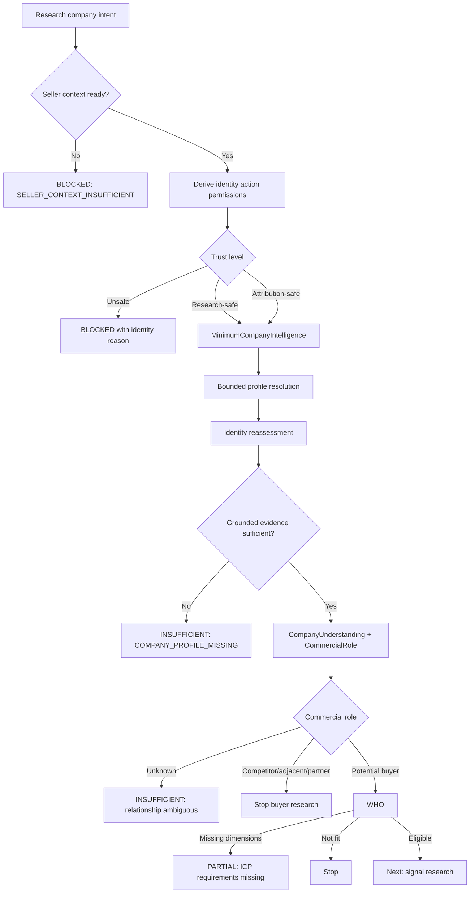
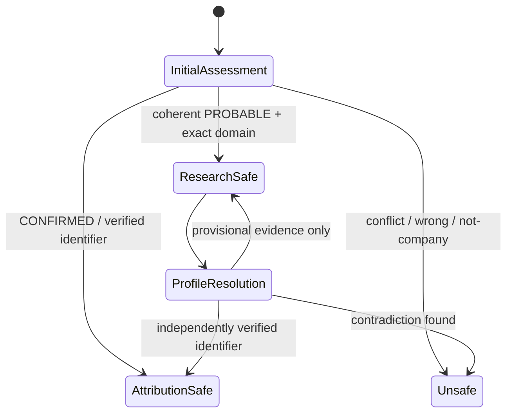
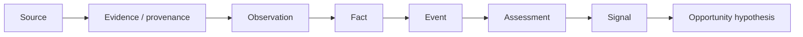

# JYRA Architecture V1

## Status

This document describes the implemented architecture as of September 2, 2026.
It is intentionally not a target-state design. Unimplemented or incomplete
areas are called out explicitly.

## 1. Architectural principles

JYRA uses a deterministic control plane around bounded semantic capabilities.
Deterministic services own authorization, tenant isolation, identity
permissions, provider routing, budgets, state transitions, caching,
idempotency, provenance, and validation. The language model is used only for
grounded CompanyUnderstanding and seller-relative CommercialRole reasoning.

Missing information is not negative evidence. `UNKNOWN`, `INSUFFICIENT`, and
`BLOCKED` outcomes require a machine-readable reason and a next-action policy.
Provider failure is operational state, not a business conclusion.

## 2. Architecture inventory

| Category | Component | Responsibility | Inputs / outputs | Calls provider or LLM | Persistence | Consolidation status |
|---|---|---|---|---|---|---|
| A Orchestrator | `orchestrateCompanyIntelligence` | Seller readiness → identity permissions → MinimumCompanyIntelligence → fresh/reassessed CompanyUnderstanding/CommercialRole → WHO | Project/company IDs, router → structured status, reason, missing requirements, next capability | Bounded providers and frozen semantic model through capabilities | Project role, freshness fingerprint, and provenance | Authoritative company-intelligence path |
| A Workflow | `executeResearchNow` | Runs prerequisite control plane, then buyer-only research planning/execution | User intent and project company → stop result or research result | Provider capabilities after prerequisites | Jobs, requests, evidence, facts | All roles use the same control plane |
| A Workflow | `discoverCompaniesForProject` | Buyer-market discovery, identity assessment, safe canonical linking, optional automatic intelligence handoff | Seller/ICP context and provider router → discovery cohort with control outcomes | `COMPANY_DISCOVERY`, bounded identity lookup/profile search, then control-plane capabilities | Discovery run, project membership, discovery provenance | Production discovery routes accepted candidates into the control plane |
| B Resolver | `resolveProjectSellerContext` | Authoritative Business Twin, Offering, ICP, pack readiness | Project/organization → versioned context and missing requirements | No | Reads authoritative versions | Reused unchanged |
| B Resolver | `resolveAndPersistCompanyProfile` | Bounded company-profile resolution with cache and verification | Project company, known identifiers, discovery evidence | `WEB_SEARCH`, maximum two calls | Verified result or project-scoped review evidence | Reused; now reachable for research-safe identity |
| B Resolver | `enrichCompanyFirmographics` | Firmographic resolution after identity verification | Project company and router | `COMPANY_FIRMOGRAPHICS` | Scoped provenance and safe canonical updates | Reused unchanged |
| C Provider adapter | Provider adapters | Vendor-specific request/response translation | Capability request → normalized provider response | External provider | Usage ledger via router | Reused unchanged |
| D Normalizer | Company identity and canonical profile helpers | Names, domains, URLs, industries, employee ranges, evidence projection | Raw/canonical data → normalized deterministic values | No | No direct persistence | Reused unchanged |
| E Semantic capability | `assessCompanySemantically` | Grounded CompanyUnderstanding plus seller-relative CommercialRole | Seller context and evidence UUIDs → strict semantic output | Frozen `gpt-5-mini` prompt | Append-only semantic provenance | Frozen logic reused |
| F Guardrail | `deriveIdentityPermissions` | Action-risk permissions from current identity state and evidence | Domain and newest-first provenance → trust level and permissions | No | Included in MinimumCompanyIntelligence provenance | New consolidated policy |
| F Guardrail | Evidence/fact validation | Attribution, source, temporal, and claim validation | Provider output → accepted/rejected evidence/facts | No | Evidence, reviews, facts | Reused unchanged |
| G Decision engine | Buyer Role 06A | Deterministic fallback role assessment | Primary-business and seller-relative context → role | No | Project membership assessment | Frozen and reused |
| G Decision engine | WHO qualification | ICP qualification separate from commercial role | Company profile and ICP → fit state | No | Existing project state | Reused unchanged |
| H Store | Companies and aliases | Global canonical identity | Verified identifiers → canonical company | No | PostgreSQL | Reused unchanged |
| H Store | Company provenance/evidence/facts | Traceable source and intelligence history | Scoped observations and decisions | No | PostgreSQL, append-only where required | Reused; provisional review source stays distinct |
| I Cost/cache | Provider router and research economics | Capability routing, provider selection, call usage, budgets | Capability and context → response/usage | Provider dispatch | Cost/request records | Reused unchanged |
| I Cache | Semantic fingerprint cache | Exact seller/evidence/model/prompt cache | Fingerprint → cached terminal decision | No on hit | Append-only semantic provenance | Reused unchanged |
| J Outcome | Recommendation Ledger and outcome foundation | Snapshot recommendations and later outcomes | Versioned assessment → ledger | No | Append-only ledger | Reused unchanged |
| K API/UI | Research routes and DigiSignal views | Send user intent; display progress and stop state | API request/response | No direct provider logic | No business-state ownership | Backend remains authoritative |
| L Compatibility | Direct semantic reassessment utility | Preserves validation-script report shape | Company IDs → control-plane outcomes projected as semantic reports | Control plane decides | Project role/provenance | Wrapper over the authoritative orchestrator |

## 3. Anti-pattern findings

### Corrected

- **BOOLEAN_IDENTITY_GATE / RESOLUTION_CAPABILITY_NOT_INVOKED:** MinimumCompanyIntelligence previously required attribution-safe identity before public profile research. Eighteen of twenty DigiPuush candidates stopped before the resolver that could strengthen identity. Identity is now action-scoped.
- **EVIDENCE_NOT_PROPAGATED:** Project-scoped unverified profile-review evidence was excluded from CompanyUnderstanding. It is now a permitted provisional evidence source while remaining distinct from verified canonical profile provenance.
- **STATUS_AS_TERMINAL_GATE:** The unresolved Research Now path now consumes structured control-plane reasons and next capabilities instead of interpreting `UNKNOWN` alone.
- **MISSING_REASON_CODE:** MinimumCompanyIntelligence and the control plane now expose stable reason codes, missing requirements, retry guidance, and next capability.
- **STALE_STATE_USED_AFTER_RESEARCH:** The control plane reloads the company and membership after bounded resolution before semantic assessment and persistence.

### Remaining

- **WHO REASON GRANULARITY:** WHO reason detail is maintained by the focused ICP-evidence workstream.
- **DURABLE RUN TRACE:** Capability decisions are reconstructable from existing provenance and cost records, but there is no single materialized control-plane execution record.

## 4. Control plane

The company-intelligence control plane is deterministic. It:

1. resolves and validates seller context;
2. derives identity permissions from newest-first scoped provenance;
3. runs bounded MinimumCompanyIntelligence only when public research is safe;
4. reassesses identity after resolver evidence;
5. runs frozen CompanyUnderstanding/CommercialRole only when permitted and grounded;
6. reuses a resolved role only when its control-plane fingerprint still matches seller context, company profile, evidence, and policy versions;
7. treats `UNKNOWN` as unresolved and therefore never freshness-reusable;
8. persists the project-relative role and exact freshness fingerprint;
9. evaluates WHO separately;
10. returns a structured status, reason code, missing requirements, retry/manual-review guidance, and next capability.

The control plane never asks an LLM which capability to run.

## 5. Progressive identity trust

Identity permissions are derived; they are not stored as independent booleans.

### Attribution-safe

Granted when a verified profile/firmographic identifier agrees with the exact
canonical domain, or a current confirmed discovery identity meets the
deterministic policy. It may attach canonical facts, generate signals, rank
opportunities, and enrich contacts subject to their other guards.

### Research-safe

Granted to the current coherent `PROBABLE` discovery identity when the exact
domain agrees, the discovery canonical was explicitly admitted for research,
and no conflict exists. It may:

- perform bounded public profile research;
- store project-scoped provisional profile evidence;
- run grounded CompanyUnderstanding and CommercialRole.

It may not attach canonical facts, generate signals, rank opportunities, or
enrich contacts merely because it is research-safe.

### Unsafe

`AMBIGUOUS`, conflicting, `WRONG_ENTITY`, `NOT_A_COMPANY`, missing-domain, and
insufficient-identity cases block operations according to the reason. Wrong
entity and explicit conflicts are not made retryable by lowering thresholds.

## 6. Provisional versus canonical evidence

Unverified profile candidates are persisted under
`COMPANY_PROFILE_RESOLUTION_REVIEW`, scoped to the project and marked private.
They may be supplied to semantic reasoning as provisional evidence with their
own provenance UUID. They are not copied to canonical company identifiers.

Only `VERIFIED` profile resolution updates canonical profile URLs. Confirmed
firmographic identity must agree with the exact canonical domain before safe
canonical projection. If a resolver finds a contradiction, the identity policy
blocks attribution-sensitive operations.

## 7. Capability contract

The implemented control-plane result follows:

- `status`: `SUCCESS | PARTIAL | INSUFFICIENT | BLOCKED`
- `reasonCode`
- human-readable `explanation`
- `missingRequirements[]`
- `nextRecommendedCapability`
- retry and manual-review guidance
- capability-specific outputs
- version

Existing provider responses carry provider identity, request identity, status,
usage/cost, sources, retryability, capture time, and structured errors.
Semantic results carry evidence UUIDs, confidence, model, prompt version, and
normalization version.

## 8. State, reason, and next action

Important implemented reasons include:

- `SELLER_CONTEXT_INSUFFICIENT`
- `IDENTITY_CONFLICT`
- `WRONG_ENTITY`
- `NOT_A_COMPANY`
- `DOMAIN_MISSING`
- `IDENTITY_EVIDENCE_INSUFFICIENT`
- `COMPANY_PROFILE_MISSING`
- `COMMERCIAL_RELATIONSHIP_AMBIGUOUS`
- `COMPETITOR_NOT_ELIGIBLE`
- `ADJACENT_VENDOR_NOT_ELIGIBLE`
- `PARTNER_NOT_ELIGIBLE`
- `ICP_REQUIREMENTS_MISSING`
- `ICP_NOT_FIT`
- `READY_FOR_SIGNAL_RESEARCH`

These codes, rather than free text, drive workflow behavior.

## 9. Data and evidence plane

The durable chain remains:

Simple profile projection need not materialize every layer. Any material buyer
role, WHO, signal, WHY, or opportunity claim must remain traceable to scoped
evidence/provenance.

## 10. Semantic intelligence plane

The current semantic capability remains intentionally small:

- CompanyUnderstanding: what the company does;
- CommercialRole: seller/offering-relative relationship.

The prompt, model, normalization version, output schema, evidence validation,
confidence behavior, fingerprinting, and append-only cache semantics remain
frozen. Normalization, identity, routing, validation, and state transitions
remain deterministic.

## 11. WHO / WHEN / WHY separation

- CommercialRole asks whether the organization can be a buyer, competitor,
  adjacent vendor, partner, or unknown relative to this offering.
- WHO asks whether a potential buyer fits the current ICP.
- WHEN asks whether relevant activity is happening.
- WHY explains a supported opportunity from one atomic evidence snapshot.

This architecture consolidation changed neither WHEN nor WHY.

## 12. Research Now

The frontend sends intent. Research Now always delegates prerequisite decisions
to the company-intelligence control plane. Only a
`POTENTIAL_BUYER` with eligible WHO proceeds into existing research planning.
Provider failure remains a research/provider status and never becomes a
negative buyer conclusion.

Already-resolved roles are reused without another model call when their exact
control-plane fingerprint is current. Seller, profile, evidence, or policy
changes invalidate the fingerprint and re-enter semantic assessment, whose own
exact fingerprint cache still prevents duplicate model spend.

## 13. Provider routing and cost

Business logic requests provider-neutral capabilities. The router selects
enabled adapters, applies provider order and fallback, and records usage.
Profile resolution is bounded to two searches. Unknown actual cost remains
unknown; it is not converted to zero. Research budgets reserve expected cost
before provider dispatch and reconcile terminal accounting before downstream
processing.

## 14. Idempotency and durability

- semantic decisions lock exact fingerprints in PostgreSQL;
- terminal semantic outcomes are cached;
- transient provider failures remain retryable;
- profile resolution uses scoped freshness cache;
- research uses idempotency keys and preserves failed attempts;
- opportunity-pack activation locks the target version;
- recommendation and evidence histories remain append-only where required.

The current PostgreSQL job architecture supports the MVP. No Temporal or
LangGraph migration is justified by a demonstrated limitation in this cycle.

## 15. Observability

Existing records can reconstruct provider requests, costs, evidence, semantic
fingerprints, model/prompt versions, and research terminal states. The new
MinimumCompanyIntelligence provenance includes identity permissions, reason
code, missing requirements, attempts, evidence IDs, and next capability.

A unified control-plane execution ledger is not implemented.

## 16. Tenant isolation

Control-plane entry points require organization and project identifiers.
Seller context validates project ownership. Company evidence and semantic
decisions are selected by project and company. Company canonical identity may
be global, but private profile, decision, and research provenance remains
scoped. Existing service-level authorization remains the boundary for API
callers.

## 17. Learning boundary

Live models and agents do not self-modify. Recommendation snapshots and
outcomes can support future offline evaluation and versioned controlled
deployment. No new learning algorithm was added.

## 18. Intentional MVP exclusions

This consolidation does not add providers, contacts, outreach, Explee,
buying-committee reasoning, a vector database, Neo4j, Temporal, LangGraph, new
Managed SOC signals, prompt tuning, ICP tuning, or benchmark-specific
production logic.

## 19. Implemented invariants and validation

Current focused regressions verify:

- coherent `PROBABLE` identity permits public profile research but not
  canonical/high-impact actions;
- conflicting identity blocks research;
- bounded profile resolution remains at most two calls;
- semantic evidence UUID validation and exact fingerprint cache behavior;
- wrong-entity and ambiguous discovery gates remain fail-closed;
- provider failure/retry and same-day research idempotency;
- profile canonical updates require verified identity;
- CompanyUnderstanding/CommercialRole prompt and versions remain frozen.

The required fresh 10 DigiPuush + 10 Managed SOC validation has **not** been
run. It belongs to the separate bounded cross-domain validation workstream.

## 20. Current architecture verdict

The progressive identity deadlock and duplicate orchestration paths are
corrected. The architecture still requires its frozen cross-domain validation
before the 50-company Reality Test.

**C — READY FOR BOUNDED CROSS-DOMAIN VALIDATION**